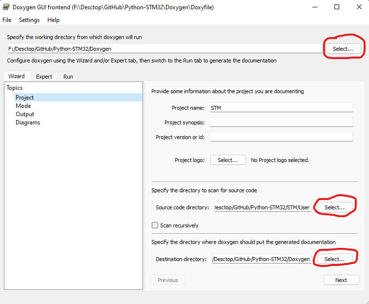

# Описание doxygen 

### Просмотр документации

Необходимо открыть файл `index.html` в паке `html` для просмотра описания файлов, функций и различных графов вызовов функций.

### Генерация документации

Скачиваем приложение `doxywizard.exe` и `graphViz` открываем файл `doxefile` через `doxywizard.exe`, меняем выбранные пути к файлам 

